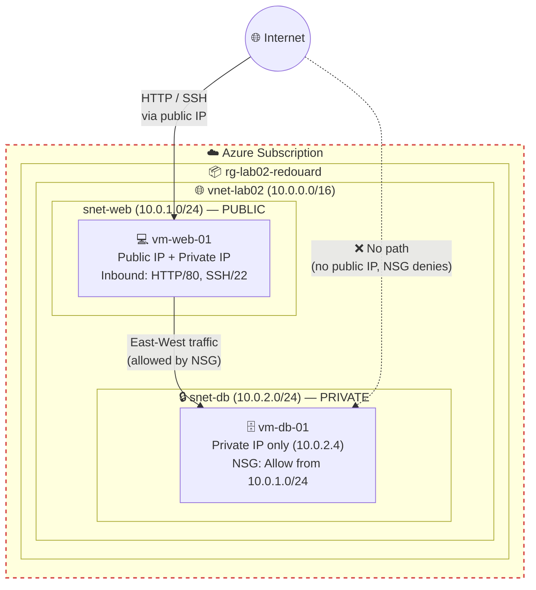

# Azure Two-Tier Web Application Lab

> **The Build Log — Lab 002 of 12**
> *A public web subnet, a private database subnet, and an NSG that makes sure only one of them can talk to the other.*

[](#)
[](#)
[](#)
[](#)
[](LICENSE)

> **Author:** Ralph Edouard II
> **Series:** The Build Log — Azure Fundamentals
> **Status:** ✅ Completed

---

## 🙏 Credit

Lab 002 is part of a structured Azure curriculum **Jhante Charles** built for me to accelerate my Cloud Security Engineer transition. The lab design and instructions are his. The execution, walkthrough videos, architecture diagram, security analysis, and writeup are mine.

---

## 🎬 Watch Me Build This Lab

Three-part walkthrough, in order:

| Part | What's covered | Link |
| --- | --- | --- |
| **2.1** | VNet, two subnets, both VMs deployed | [▶ Watch](https://www.loom.com/share/e80b0bf0ce7141c09a13a6e3151519e2) |
| **2.2** | SSH into the web VM, ping the database VM on its private IP | [▶ Watch](https://www.loom.com/share/375d069e64a74e768f712a292f1e1693) |
| **2.3** | NSG rule locking the database down to the web subnet, then cleanup | [▶ Watch](https://www.loom.com/share/f4b37740eca5484ba25ae7cc3a9967a8) |

---

## 👋 About This Lab

Lab 001 was files in a container. Lab 002 is the first real architecture in this series: a classic two-tier IaaS setup. A web server that faces the internet, a database server that doesn't, and the network controls that keep it that way.

Coming from a SysAdmin background, this one felt familiar — I've managed segmented networks before. The difference is that in Azure, every one of those boundaries is a configuration choice you make (or forget to make) at deploy time. There's no network team doing it for you.

---

## 📌 What I Built

- One Virtual Network (`10.0.0.0/16`) with two subnets
  - `snet-web` (`10.0.1.0/24`) — public-facing
  - `snet-db` (`10.0.2.0/24`) — private
- `vm-web-01` in the web subnet, with a public IP, accepting HTTP (80) and SSH (22) from the internet
- `vm-db-01` in the database subnet, with **no public IP at all**
- A Network Security Group rule on the database VM that allows inbound traffic **only** from the web subnet

The database VM is reachable from exactly one place: the web subnet. Not from the internet, not from anywhere else in the VNet. That's the entire point of the lab.

---

## 🏗️ Architecture



Two things the diagram is showing:

1. **North-south** — the internet can reach the web VM and nothing else.
2. **East-west** — the web VM can reach the database VM, and the NSG is what says so explicitly.

The dotted red line is the one that matters. There is no route from the internet to the database server, and even if someone found one, the NSG would drop it.

---

## 🎯 What I Practiced

- Designing a VNet address space and carving it into subnets
- Deploying VMs into specific subnets on purpose (not whatever the default picks)
- Choosing *not* to assign a public IP, and understanding what that means operationally
- SSH key pair creation and management at VM deploy time
- Using one VM as a jump host to reach another with no public address
- Writing an NSG rule and understanding how priority ordering decides what gets evaluated first
- Cleaning up the whole resource group when done

---

## ✅ What You'll Need

| Requirement | Notes |
| --- | --- |
| Active Azure subscription | Free Tier works |
| Azure Portal access | — |
| A terminal with `ssh` | Windows Terminal, macOS Terminal, WSL — any of them |
| About 60 minutes | Longer the first time |

---

## 🧾 Naming Convention

| Resource | Name | Notes |
| --- | --- | --- |
| Resource Group | `rg-lab02-<yourname>` | I used `rg-lab02-redouard` |
| Region | I chose `EastUS1' | Pick what's closest to you |
| VNet | `vnet-lab02` | `10.0.0.0/16` |
| Subnet (public) | `snet-web` | `10.0.1.0/24` |
| Subnet (private) | `snet-db` | `10.0.2.0/24` |
| Web VM | `vm-web-01` | Ubuntu Server 20.04 LTS, `Standard_B1s` |
| Database VM | `vm-db-01` | Ubuntu Server 20.04 LTS, `Standard_B1s` |
| SSH key pair | `key-lab02` | Created on the web VM, reused on the DB VM |

> 💡 The subnet ranges have to sit cleanly inside the VNet's `/16`. If they overlap each other or fall outside it, Azure rejects the VNet before you ever get to deploy a VM.

---

## 🛠️ How I Built It

### Phase 1 — The Network Foundation

1. **Virtual networks** → **+ Create**.
2. **Basics:** new resource group `rg-lab02-<yourname>`, name `vnet-lab02`, your region.
3. **IP addresses:** address space `10.0.0.0/16`. Add two subnets:
   - `snet-web` — `10.0.1.0/24`
   - `snet-db` — `10.0.2.0/24`
4. **Review + create** → **Create**.

### Phase 2 — The Web Server (public tier)

1. **Virtual machines** → **+ Create**.
2. **Basics:** resource group `rg-lab02-<yourname>`, name `vm-web-01`, Ubuntu Server 20.04 LTS, size `Standard_B1s`.
3. **Administrator account:** SSH public key, key pair name `key-lab02`.
4. **Inbound ports:** allow **HTTP (80)** and **SSH (22)**.
5. **Networking:** VNet `vnet-lab02`, subnet `snet-web`, public IP **Create new**.
6. **Review + create** → **Create** → **Download private key** when prompted.

> ⚠️ The private key download happens once. Save the `.pem` somewhere you'll find it. If you lose it, you're redeploying the VM.

### Phase 3 — The Database Server (private tier)

1. **Virtual machines** → **+ Create**.
2. **Basics:** same resource group, name `vm-db-01`, Ubuntu Server 20.04 LTS, `Standard_B1s`.
3. **Administrator account:** use existing key stored in Azure → `key-lab02`.
4. **Inbound ports:** SSH (22) only.
5. **Networking — this is the step that matters:**
   - VNet: `vnet-lab02`
   - Subnet: change to **`snet-db`**
   - Public IP: **None**
6. **Review + create** → **Create**.

> The portal defaults to giving every VM a public IP. Setting it to **None** is a deliberate choice, and it's the choice that makes this a private tier.

### Phase 4 — Validate Connectivity (the jump)

The database VM has no public IP, so you can't reach it from your machine. You reach the web VM, then hop.

1. Grab the **private IP** of `vm-db-01` from its Overview blade. Mine was `10.0.2.4`.
2. Grab the **public IP** of `vm-web-01`.
3. SSH into the web VM:

```bash
   ssh -i key-lab02.pem azureuser@<public-ip-of-web-vm>
```

4. From inside the web VM, ping the database VM:

```bash
   ping 10.0.2.4
```

5. Replies come back. The two tiers can talk. `Ctrl+C` to stop.

### Phase 5 — Lock the Database Down (NSG)

Right now anything inside the VNet can reach `vm-db-01`. The goal is: only the web subnet.

1. Open `vm-db-01` → **Networking** → click the attached NSG (it'll have an auto-generated name like `vm-db-01-nsg`).
2. **Inbound security rules** → **+ Add**.
3. Build the rule:

   | Field | Value |
   | --- | --- |
   | Source | IP Addresses |
   | Source IP addresses/CIDR | `10.0.1.0/24` |
   | Source port ranges | `*` |
   | Destination | Any |
   | Service | Custom |
   | Destination port ranges | `*` |
   | Action | Allow |
   | Priority | `100` |
   | Name | `Allow-Web-Subnet` |

4. **Add**.
5. Back in your SSH session on the web VM, `ping 10.0.2.4` again. Still works — the rule allows exactly what it should.

> **On priority:** NSG rules evaluate from the lowest number up. `100` fires before any of Azure's default rules (which sit at 65000+). Anything that doesn't match an explicit Allow falls through to the default DenyAllInbound at the bottom.

### Phase 6 — Cleanup

**Resource groups** → `rg-lab02-<yourname>` → **Delete resource group** → type the name → **Delete**.

Same session. Not later. See Lab 001 for the $1,000 reason.

---

## 🔐 Security Things I Noticed

Still early on the cloud security side. Observations, not expert guidance:

- **The web VM is doing two jobs.** It's the application front end *and* the only path to the database. In this lab that's fine. In production, the web tier shouldn't double as the management plane — a dedicated bastion host (or Azure Bastion) should be the jump box, and the web server should never need SSH open to the internet at all.
- **SSH/22 is open to the whole internet on the web VM.** For a lab, acceptable. For anything real, that source should be scoped to a known IP or replaced with Bastion entirely.
- **The NSG rule allows any destination port from the web subnet.** The lab says to use `*` since there's no actual database installed. If this were real, that would be `3306` (MySQL) or `5432` (Postgres) — nothing else. "Allow all from a trusted subnet" is still broader than it needs to be.
- **"No public IP" is necessary, not sufficient.** The database VM was reachable from anywhere in the VNet until Phase 5. Network placement reduces exposure; NSGs enforce it. You need both.
- **No logging.** No NSG flow logs, no diagnostic settings. If something hit that database VM, I'd have no record of it. Something to come back to.

---

## 💰 What This Cost

Two `Standard_B1s` VMs, a VNet, and one public IP for roughly an hour.

The B1s tier is cheap per hour. It stops being cheap if two of them run for a week because you forgot to delete the resource group.

---

## 🧰 Stuff That Tripped Me Up

**Subnet validation failed on the VNet**
The subnet ranges have to fit inside the VNet's address space and can't overlap each other. `10.0.1.0/24` and `10.0.2.0/24` inside `10.0.0.0/16` is clean. Fat-finger one of them and Azure stops you at the VNet creation step.

**Where's the SSH key?**
It downloads once, at the moment the web VM is created. If you click past the prompt, it's gone. For the DB VM, pick "use existing key stored in Azure" so you're not managing two.

**Ping fails from web to DB**
Usually one of three things: the DB VM hasn't finished deploying yet, the DB VM landed in `snet-web` instead of `snet-db`, or the two VMs aren't in the same VNet. Check the DB VM's Overview blade — subnet and private IP are both right there.

**"How do I SSH into the database VM?"**
You don't, not from your machine. No public IP means no direct path. You SSH to the web VM and work from there. Actually SSHing from web → DB means getting the `.pem` onto the web VM, which this lab doesn't cover.

---

## 🧠 What I Took Away

- The architecture is four decisions: which subnet, public IP or not, what the NSG allows, what priority it runs at. Everything else is clicking through the portal.
- "Private" in Azure isn't a setting. It's the *absence* of a public IP plus NSG rules that enforce the boundary. Skip either half and it's not private.
- The web VM being the only way in is both the security model and the biggest weakness. First time in this series I looked at something I built and thought about how I'd get through it instead of how I'd administer it.
- NSG priority ordering is the thing that'll bite you in a real environment. Lower number wins. Write the rule, then check what's above it.

---

## 📚 References

- [Azure Virtual Network overview — Microsoft Learn](https://learn.microsoft.com/azure/virtual-network/virtual-networks-overview)
- [Network security groups — Microsoft Learn](https://learn.microsoft.com/azure/virtual-network/network-security-groups-overview)
- [How NSG rules are evaluated — Microsoft Learn](https://learn.microsoft.com/azure/virtual-network/network-security-group-how-it-works)
- [Azure Bastion — Microsoft Learn](https://learn.microsoft.com/azure/bastion/bastion-overview)

---

## 🗺️ The Build Log Series

- [Lab 001 — Azure Static Website Hosting](https://github.com/redouard2/azure-static-website-lab)
- **Lab 002 — Two-Tier Web Application** ← *you are here*
- Lab 003 — *coming soon*

---

*Part of my Cloud Security Engineer transition. Writing these up the way I'd want them written for me.*
